# Movie Savvy RAG 2.0

## Introduction

Movie Savvy RAG 2.0 is a sophisticated Retrieval-Augmented Generation (RAG) system designed to answer entertainment-related queries with precision and enthusiasm. Tailored for fans of movies, anime, manga, K-dramas, K-movies, and Bollywood, this system integrates local knowledge from a vector database, real-time web insights, and YouTube video analysis to deliver engaging, geeky, and concise responses. Powered by the Mistral-7B-Instruct-v0.3 model, it leverages advanced intent classification and function calling to dynamically source content, making it a versatile tool for entertainment enthusiasts.

Whether you're curious about the latest MCU phases, the intricacies of a One Piece manga chapter, or want a breakdown of a Bollywood blockbuster, Movie Savvy RAG 2.0 combines cutting-edge AI with a fan-friendly tone to enhance your entertainment exploration.

---

## Key Features

Movie Savvy RAG 2.0 is packed with powerful functionalities that set it apart as an entertainment-focused AI assistant. Here’s what makes it tick:

- **FAISS Vector Database**: Employs FAISS (Facebook AI Similarity Search) with an `IndexIVFFlat` index for fast and efficient similarity searches. It retrieves relevant content chunks from a preprocessed entertainment dataset stored in embeddings, enabling quick access to local knowledge.

- **Web Search Enabled**: Integrates with the Tavily API to fetch real-time web content. This feature is triggered for queries requiring current information (e.g., "latest" or "recent" events), ensuring responses stay up-to-date with web insights.

- **YouTube Video Analysis**: Utilizes the YouTube Data API for video searches and SearchAPI.io for transcript extraction. It analyzes video content by chunking transcripts and embedding them, perfect for queries needing trailers, reviews, or fan discussions.

- **Intent Classification**: Features an `EnhancedIntentClassifier` that analyzes query intent using both rule-based patterns and the Mistral model. It determines whether YouTube or web content is needed, optimizing retrieval strategies with high accuracy.

- **Semantic Content Scoring**: Implements a `SemanticContentProcessor` with the `intfloat/e5-large-v2` model to score and filter retrieved chunks based on semantic relevance to the query, ensuring only the most pertinent information is used.

- **Response Generation with Mistral-7B-Instruct-v0.3**: Leverages the Mistral-7B-Instruct-v0.3 model, which supports function calling via structured prompts. This enables dynamic content integration and generates conversational, fan-friendly responses.

- **Response Refinement**: Uses a `ResponseRefiner` to validate and polish responses against retrieved contexts, enhancing accuracy and coherence by filtering out irrelevant or low-confidence sentences.

- **Multi-Source Content Integration**: Combines local database chunks, web search results, and YouTube transcripts, weighted dynamically based on query intent (e.g., prioritizing YouTube for trailer requests).

- **Function Calling**: The Mistral model’s function calling capability orchestrates content retrieval through the `FunctionManager`, coordinating vector searches, web searches, and YouTube processing seamlessly.

- **Configurable Pipeline**: Managed by multiple YAML configuration files (`rag_config.yaml`, `model_config.yaml`, `processing_config.yaml`, `generation_config.yaml`) for flexible settings, from chunk sizes to generation parameters.

- **Experiment Tracking with MLflow**: Utilizes MLflow to track and analyze experiments, optimizing retrieval and generation parameters. Experiments identified `top_k = 8` and `similarity_threshold ≈ 0.61` as a high-fluency sweet spot, and `max_new_tokens = 1024`, `temperature = 0.6`, `top_k_sampling = 70`, with a tweak to `repetition_penalty = 1.1` for factual accuracy, balancing relevance, consistency, fluency, and efficiency.

---

## Setup Instructions

Setting up Movie Savvy RAG 2.0 involves preparing your environment, installing dependencies, processing data, and running the system. Follow these detailed steps to get started.

### Prerequisites

Before you begin, ensure you have the following:

- **Operating System**: Linux, macOS, or Windows (with WSL recommended for Windows users).
- **Python**: Version 3.8 or higher.
- **Git**: For cloning the repository.
- **DVC (Data Version Control)**: For managing data preprocessing and index building pipelines.
- **CUDA**: Optional but recommended for GPU acceleration (requires NVIDIA GPU and compatible drivers).
- **API Keys**:
  - **YouTube Data API Key**: For video searches.
  - **SearchAPI.io Key**: For YouTube transcript extraction.
  - **Tavily API Key**: For web searches.
- **Disk Space**: At least 50GB free for model weights, embeddings, and processed data.
- **RAM**: Minimum 16GB (32GB+ recommended for optimal performance with GPU).

### Installation Steps

1. **Clone the Repository**
   Clone the Movie Savvy RAG 2.0 repository to your local machine:
   ```bash
   git clone https://github.com/yourusername/movie-savvy-rag.git
   cd movie-savvy-rag
   ```

2. **Install Dependencies**
   Install the required Python packages listed in `requirements.txt`. It’s recommended to use a virtual environment:
   ```bash
   python -m venv venv
   source venv/bin/activate  # On Windows: venv\Scripts\activate
   pip install -r requirements.txt
   ```

3. **Set Up Environment Variables**
   Create a `.env` file in the root directory and add your API keys:
   ```env
   YOUTUBE_API_KEY=your_youtube_api_key
   SEARCHAPI_TRANSCRIPT_KEY=your_searchapi_io_key
   TAVILY_API_KEY=your_tavily_api_key
   ```
   Replace the placeholders with your actual keys. These are loaded by `dotenv` in the scripts to access external APIs.

4. **Install DVC**
   Install DVC to manage the data pipeline:
   ```bash
   pip install dvc
   ```

5. **Pull Raw Data (Optional)**
   If raw data isn’t included in the repository, ensure the `rag_system/data/raw` directory contains JSON files (`anime.json`, `bollywood.json`, `hollywood.json`, `kdrama.json`, `kmovie.json`, `manga.json`). Alternatively, use DVC to pull data:
   ```bash
   dvc pull
   ```

6. **Run Data Preprocessing and Index Building**
   Use DVC to execute the pipeline defined in `dvc.yaml`, which preprocesses data, generates embeddings, and builds the FAISS index:
   ```bash
   dvc repro
   ```
   This command runs the following stages:
   - **Preprocess**: `preprocess_data.py` cleans and chunks raw JSON data into `processed_chunks.jsonl`.
   - **Embed**: `embedder.py` generates embeddings using `intfloat/e5-large-v2` and saves them to `rag_system/data/processed/embeddings`.
   - **Build Index**: `build_index.py` constructs the FAISS index (`faiss_index.bin`) and updates metadata.

   Check `output/logs/rag_pipeline.log` for processing logs if issues arise.

7. **Verify Setup**
   Ensure the following files are generated:
   - `rag_system/data/processed/processed_chunks.jsonl`
   - `rag_system/data/processed/embeddings/*.npy`
   - `rag_system/output/index/faiss_index.bin`
   - `rag_system/output/index/metadata.json`

### Running the System

- **Interactive Mode**:
  Launch the RAG system interactively with:
  ```bash
  python rag_system/scripts/run_rag.py
  ```
  Enter queries in the console (e.g., "Explain One Piece manga 1153 in detail") and type `quit` to exit.

- **API Mode**:
  Start the FastAPI server for web-based queries:
  ```bash
  python rag_system/scripts/run_rag_api.py
  ```
  The API runs on `http://0.0.0.0:8081`. Test it with a POST request to `/query`:
  ```json
  {
    "query": "Explain the MCU phase 5 and phase 6 projects",
    "top_k": 8,
    "max_new_tokens": 500
  }
  ```
---

## Usage

### Interactive Mode
Run `run_rag.py` to engage with the system directly:
- Input a query like "What’s the plot of Train to Busan?"
- Receive a concise, geeky response based on local data, web insights, and YouTube content if applicable.

### API Mode
Access the system via the FastAPI endpoints:
- **POST /query**: Submit a JSON payload with a query and optional parameters (`top_k`, `max_new_tokens`, etc.).
- **GET /health**: Check if the API is running.
- **GET /status**: View system configuration and component status.

Results are saved as JSON files in `rag_system/output/results/` for later review.

---

## System Architecture

Movie Savvy RAG 2.0 operates through a modular pipeline:

1. **Data Preprocessing** (`preprocess_data.py`):
   - Cleans and chunks raw JSON data into manageable pieces.
   - Stores processed data in `processed_chunks.jsonl` with metadata.

2. **Embedding Generation** (`embedder.py`):
   - Uses `intfloat/e5-large-v2` to create embeddings for chunks.
   - Saves embeddings by source (e.g., `anime.npy`) in `data/processed/embeddings`.

3. **Index Building** (`build_index.py`):
   - Constructs a FAISS `IndexFlatL2` index from embeddings for efficient retrieval.
   - Saves the index and metadata in `output/index/`.

4. **Query Processing**:
   - **Intent Classification** (`intent_classifier.py`): Analyzes queries to decide if web or YouTube content is needed.
   - **Retrieval** (`retriever.py`, `chunk_embeddings.py`): Fetches relevant chunks from the FAISS index.
   - **Web Search** (`run_rag.py/run_rag_api.py`): Uses Tavily for current info.
   - **YouTube Analysis** (`youtube_handler.py`): Searches videos and extracts transcripts.

5. **Response Generation** (`generator.py`):
   - Combines contexts using a weighted approach based on intent.
   - Generates responses with Mistral-7B-Instruct-v0.3.

6. **Refinement** (`response_refiner.py`):
   - Filters response sentences for relevance using semantic similarity.

---

## Configuration

The system is highly configurable via YAML files in `rag_system/config/`:

- **`rag_config.yaml`**:
  - Defines data paths, retrieval settings (`top_k`, `similarity_threshold`), YouTube parameters, and generation defaults.
- **`model_config.yaml`**:
  - Specifies Mistral model settings (e.g., `float16` for CUDA, generation parameters like `temperature`).
- **`processing_config.yaml`**:
  - Configures intent patterns, semantic scoring thresholds, and embedding dimensions.
- **`generation_config.yaml`**:
  - Sets response generation parameters (`max_new_tokens`, `temperature`, `top_k`).


---

## Experimentation

The Movie Savvy RAG 2.0 system was rigorously optimized through a series of controlled experiments using MLflow. Two primary experimental tracks were conducted to fine-tune both retrieval and generation parameters. Visual results are stored in the `experiment_logs/exp1/` and `experiment_logs/exp2/` directories.

### MLflow Tracking Walkthrough

A brief demonstration of the MLflow dashboard used to monitor, compare, and interpret experimental runs.

**Video**:

[Watch MLflow Tracking Demo](media/exp1%20final.mp4)


---

### Experiment 1: Retrieval Parameter Tuning

**Objective**: Identify the optimal values for `top_k` and `similarity_threshold` to balance response fluency, factual consistency, relevance, and latency.

**Key Findings**:

* The optimal configuration was `top_k = 8` and `similarity_threshold ≈ 0.61`, providing strong fluency (≈ 0.56) and reliable context matching, with an average pipeline time of \~10 seconds.
* For latency-sensitive scenarios, `top_k = 5–6` and `similarity_threshold = 0.40–0.50` achieved sub-8 second latency while maintaining acceptable response quality.
* Higher similarity thresholds improved minimum context relevance but introduced increased latency (\~5 seconds overhead).
* Factual-style queries consistently achieved higher context coverage (median ≈ 0.80) compared to recommendation-type queries.

**Visualizations**:


| **Filename**     | **Description**                                                                      |
|------------------|--------------------------------------------------------------------------------------|
| 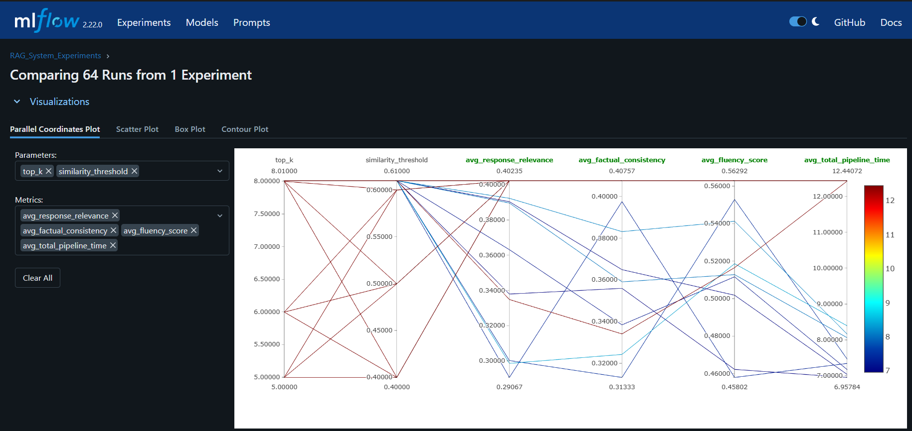 | Parallel Coordinates – Fluency vs Pipeline Time (Optimal Parameter Tuning) |
| 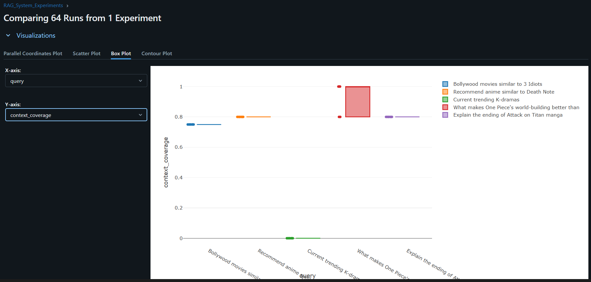 | Box Plot – Query Type Coverage (Factual vs Recommendation)                 |
| 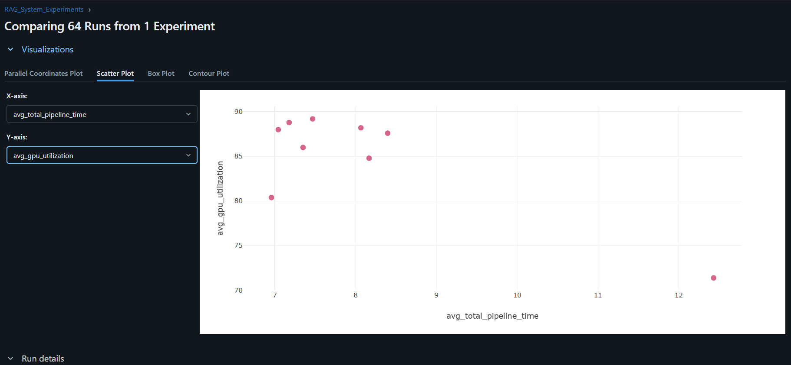 | GPU Utilization vs Pipeline Time (Resource Efficiency)                   |
| 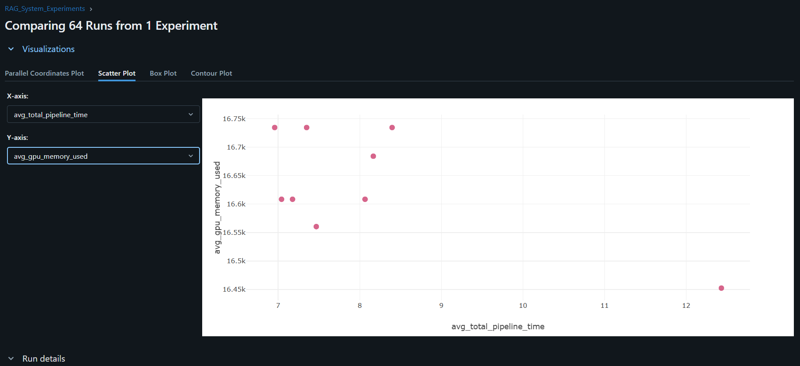 | GPU Memory Usage vs Pipeline Time (Resource Efficiency)                  |
| 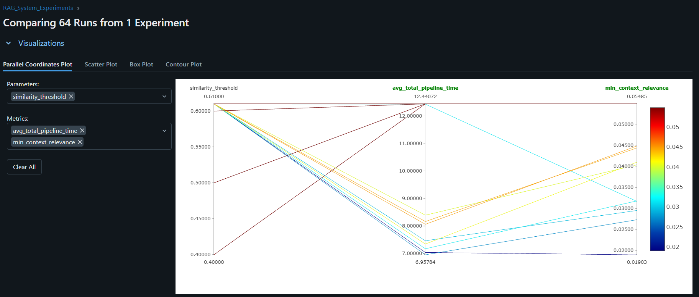 | Parallel Coordinates – Threshold Impact on Relevance and Latency           |
| 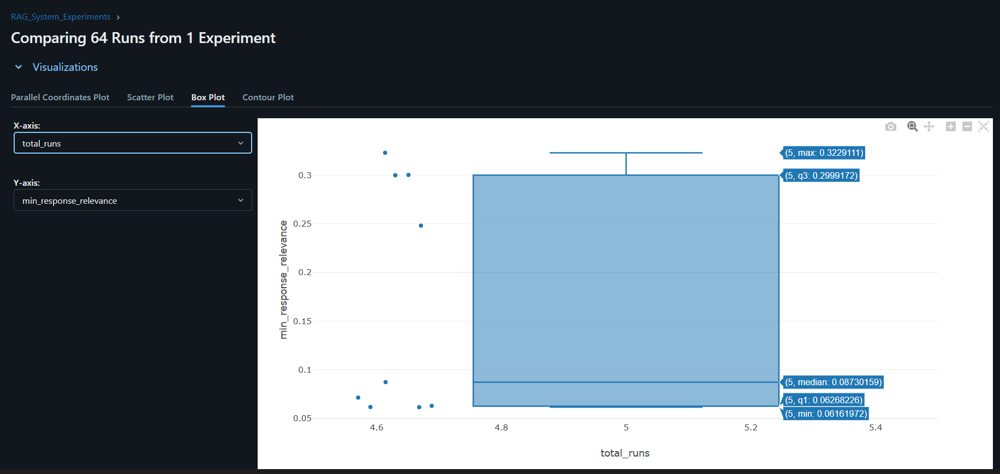 | Box Plot – Minimum Response Relevance (Failure Detection)                  |
| 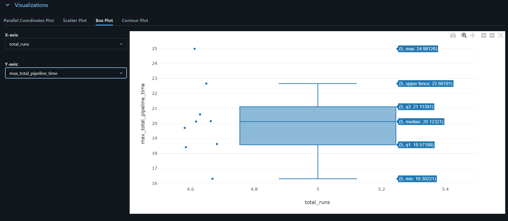 | Overall Summary of Key Tradeoffs (Combined Overview Plot)                  |


All eight plots are located in:

```
media/exp1/
```

---

### Experiment 2: Generation Parameter Optimization

**Objective**: Optimize generation parameters including `max_new_tokens`, `temperature`, `top_k_sampling`, and `repetition_penalty` to improve response quality metrics such as relevance, completeness, and factual accuracy.

**Best Run (`combo_29`) Configuration**:

* `max_new_tokens = 1024`
* `temperature = 0.6`
* `top_k_sampling = 70`
* `repetition_penalty = 1.0` (suggested: 1.1 for better factual accuracy)

**Performance Summary**:

* Achieved the highest average response relevance (0.4720) with strong coherence and completeness (0.76).
* Specificity and fluency were maximized using a `temperature` of 0.6 and `top_k_sampling` of 70.
* Adjusting `repetition_penalty` to 1.1 can further improve factual consistency.

**Visualizations**:

| Filename                        | Description                                   |
| ------------------------------- | --------------------------------------------- |
| 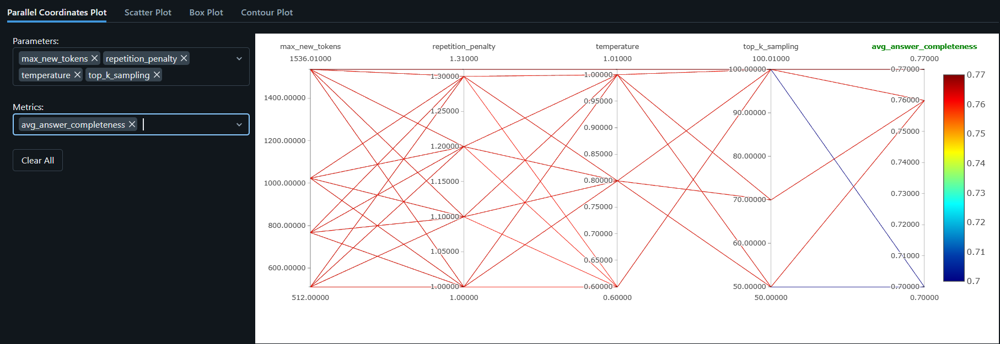      | Answer Completeness Across Parameters         |
| 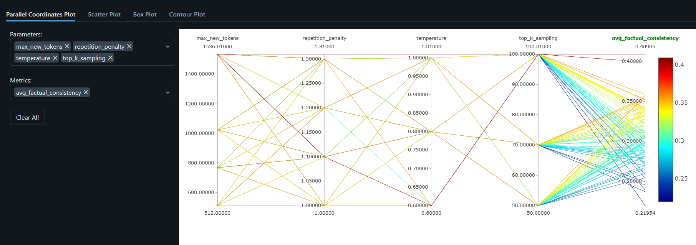      | High-Performing Combinations Overview         |
| 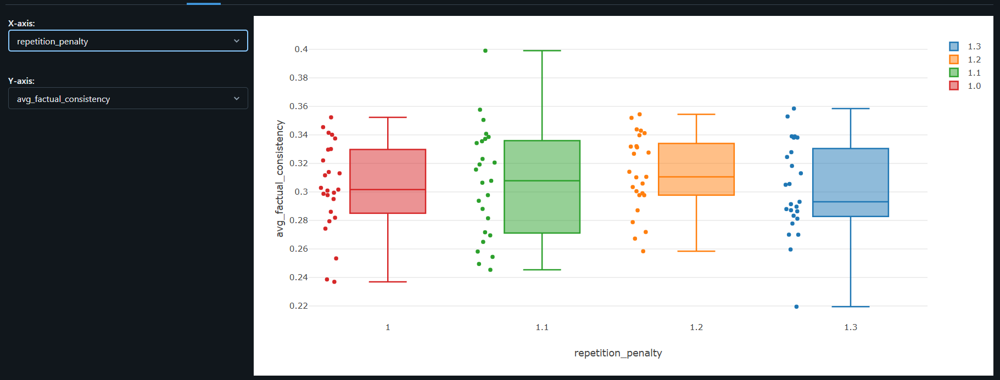      | Factual Consistency vs Repetition Penalty     |
| 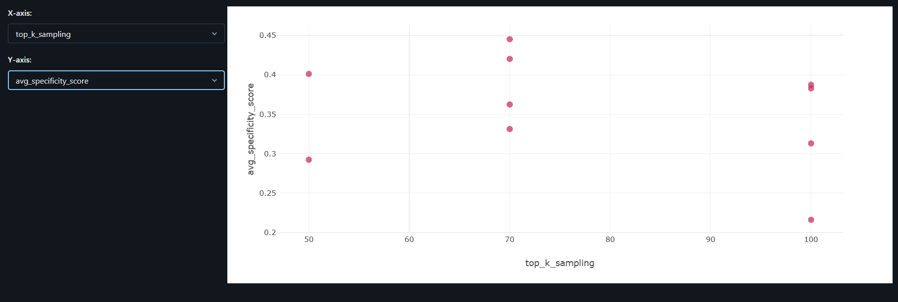      | Specificity Scores vs Sampling Top-k          |
| 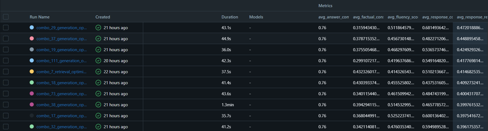      | Relevance Distribution – All Runs             |
|  | Detailed Metrics – combo_29 Best Run   |


All six plots are located in:

```
media/exp2/
```

---

### Summary Recommendations

| Use Case                | Configuration                                                                                                      |
| ----------------------- | ------------------------------------------------------------------------------------------------------------------ |
| Default (High Quality)  | `top_k = 8`, `similarity_threshold ≈ 0.61`, `temperature = 0.6`, `top_k_sampling = 70`, `repetition_penalty = 1.1` |
| Low Latency             | `top_k = 5–6`, `similarity_threshold ≈ 0.40–0.50`                                                                  |
| Exclude from Production | Runs with `min_response_relevance < 0.06` or `max_total_pipeline_time > 22.7s`                                     |

All experiments were logged and tracked using MLflow, ensuring full reproducibility and data-driven optimization.

---


### Insights and System Impact

- **Optimal Configuration**: Combining insights, the system defaults to `top_k = 8`, `similarity_threshold ≈ 0.61`, `max_new_tokens = 1024`, `temperature = 0.6`, `top_k_sampling = 70`, and suggests `repetition_penalty = 1.1` for improved factual accuracy.
- **Query Performance**: Factual queries excel with high context coverage, while recommendation queries are reliable but slightly variable.
- **Efficiency**: Lower `top_k` (5–6) and `similarity_threshold` (0.40–0.50) offer resource-efficient alternatives for latency-sensitive use cases.
- **MLflow in Action**: See the video in `experiment_logs/mlflow_demo.mp4` for a walkthrough of MLflow tracking and logging.

These findings have shaped the configurations in `rag_config.yaml` and `generation_config.yaml`, ensuring Movie Savvy RAG 2.0 delivers high-quality, efficient responses tailored to entertainment fans.

---


## System Demo

Below is a preview of the Movie Savvy RAG 2.0 chatbot in action, showing how it handles real entertainment queries using a custom Streamlit interface.

### Interface Snapshots

| **Query: One Piece Manga 1153** | **Query: Squid Game Season 3 Review** |
|----------------------------------|----------------------------------------|
| 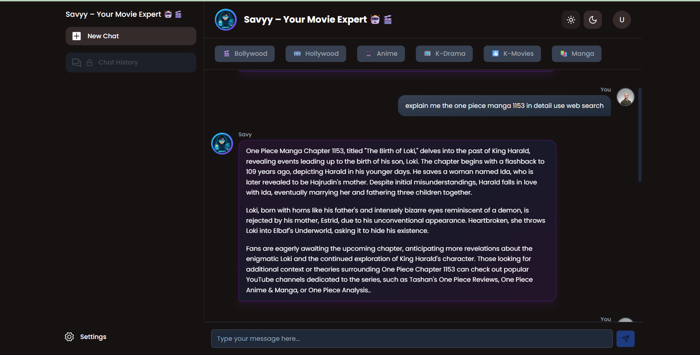 | 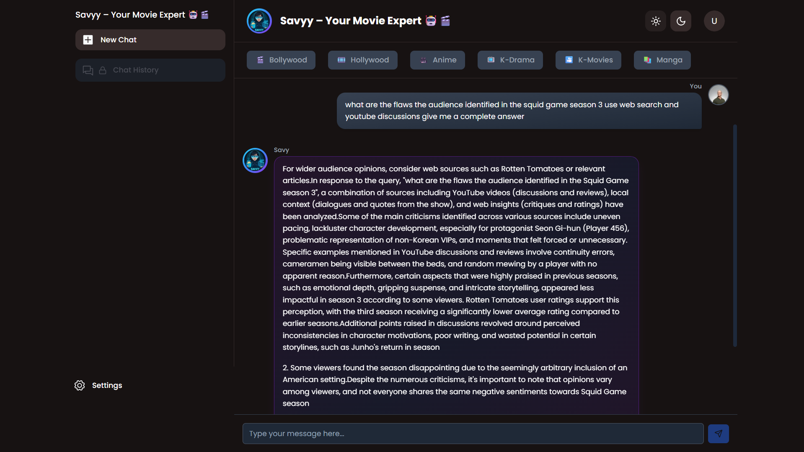     |

> The chatbot retrieves highly relevant responses from local context, web search, and YouTube transcripts depending on the query type and intent.

### Full Demo Video

[▶ Watch Full System Walkthrough](media/movie_savvy_demo.mp4)

> The video demonstrates the entire pipeline: query processing, retrieval orchestration, YouTube/Web integration, and final answer generation using the Mistral-7B model.

---


## Prompt Templates

Prompt templates in `rag_system/generation/prompt_templates/` guide the model’s behavior:
- **`intent_analysis_prompt.txt`**: Analyzes query intent for YouTube or web needs.
- **`rag_prompt.txt`**: Structures responses with local and web contexts in a fun, concise tone.
---

## Function Calling

The Mistral-7B-Instruct-v0.3 model supports function calling, implemented via:
- **`FunctionManager`** (`function_manager.py`): Orchestrates content retrieval by calling vector search, web search, and YouTube analysis based on intent.
- **Structured Prompts**: The model parses YAML responses (e.g., from intent analysis) to trigger appropriate functions, enhancing dynamic content integration.

---

## File Structure Overview

Here’s a snapshot of key directories and files:

- **`rag_system/scripts/`**:
  - `preprocess_data.py`: Data cleaning and chunking.
  - `embedder.py`: Embedding generation.
  - `build_index.py`: FAISS index creation.
  - `run_rag.py`: Interactive RAG pipeline.
  - `run_rag_api.py`: FastAPI server.

- **`rag_system/data/`**:
  - `raw/`: Raw JSON data.
  - `processed/`: Processed chunks and embeddings.

- **`rag_system/output/`**:
  - `index/`: FAISS index and metadata.
  - `results/`: Query response JSONs.
  - `logs/`: Pipeline logs.

- **`rag_system/generation/`**:
  - `generator.py`: Response generation logic.
  - `response_refiner.py`: Response polishing.

---

## Contributing

Contributions are welcome! To contribute:
1. Fork the repository.
2. Create a feature branch (`git checkout -b feature/xyz`).
3. Commit changes (`git commit -m "Add XYZ feature"`).
4. Push to the branch (`git push origin feature/xyz`).
5. Open a pull request.

Report bugs or suggest enhancements via GitHub issues.

---

## License

This project is licensed under the MIT License. See the `LICENSE` file for details.
